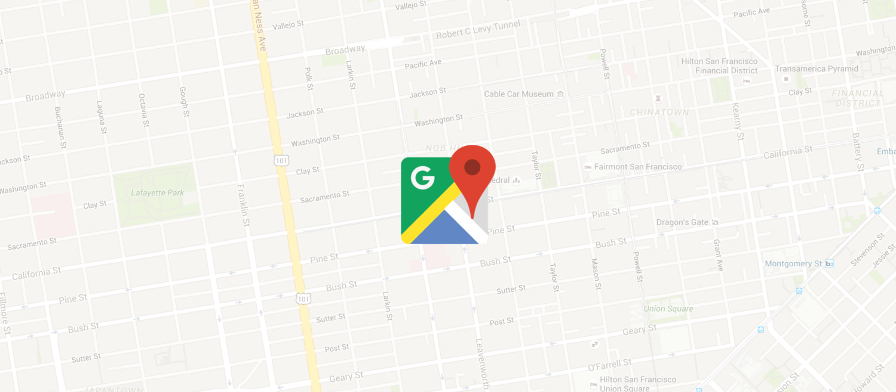
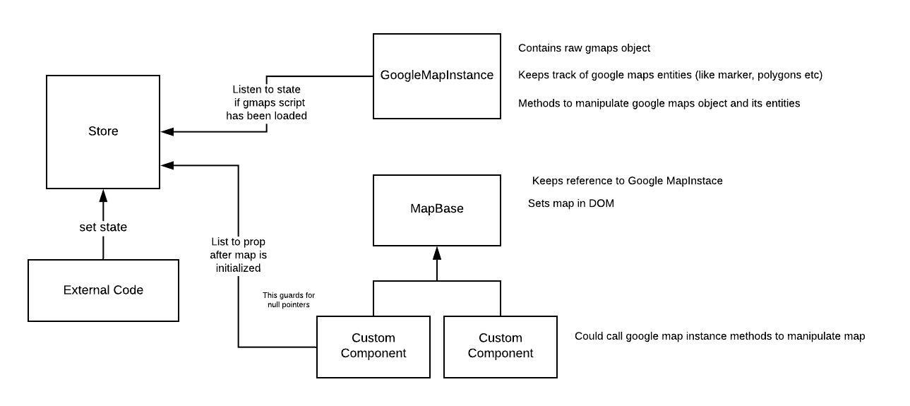

# Finding  X MEN - The Right Direction

<p align="center">
    
</p>

So far we have dealt with a method wrapper and the store this article focuses on combining both to come up with an 
infrastructure to easily create custom map components.

### Basic Infrastructure

// TODO simplify diagram
<p align="center">
    
</p>

*GoogleMapsInstance*  
Class for manipulating the raw google maps object with its methods (discussed in the first post // TODO link here)

*Store*  
Used as a single source of truth for the data of this application which uses Rxjs observables for listening to changes.

*MapBase*  
This class will be used to initialize the `GoogleMapInstance` after the map has been loaded, put the google map in the DOM, 
and pass on marker click events to its children.

*Custom Map Component*  
When first mentioned points are in place then this is where the magic happens. It will extend the MapBase so that it does
not have to do all that stuff itself. To get a new map component you only have to extend from MapBase and that's it.
You could do some map config and have some listeners. The nice thing about this is that your custom component will only
be called after the map has been loaded thus the googleMapInstance is garantueed and you can remove those pesky undefined
checks. 


#### Custom Component

If you add such a class it will generate a whole new map object and renders it in the DOM automatically. Super easy and without
duplicate code in your app when you have multiple maps in your application on different pages.

```
// Extends the MapBase to get its functionality 
export class XMenMap extends MapBase{
    
    constructor(){
        // Pass to the MapBass an html element you want this map to be rendered in
        const xmenMapContainer = document.querySelector('#xmen-map');
        super(xmenMapContainer);
    }

    // Click handler that will be called when a marker of this map has been clicked
    markerClicked(marker: MutantMarker): void {
        //do something when marker has been clicked on map
    }
}

// When you create the object it will create the whole map with its cycle
new XMenMap();
```

#### Map Base
The MapBase does the heavy lifting like initializing the `GoogleMapInstance` after the map script has loaded,
rendering the map and providing some util functions. An important thing is that it sets itself as the context in the `GoogleMapsInstance`. 
This way the `GoogleMapInstance` is able to call the `markerClicked()` through its context when a marker has been clicked on the map.
```
export class MapBase implement IMap {
    private setupMap() {

        // Initializes the GoogleMapsInstance when creates
        initGoogleMaps();

        // Tells the instance that this the current active map is
        this.googleMapsInstance.setContext(this);

        // Map renders in the html element that got passed on from its child
        this.element.appendChild(googleMapsInstance.el);
    }
}
```

#### Google Maps Instance

```
export class GoogleMapsInstance {
    // Will contain the last current active custom map component
    private context: IMap;
    
    // Set the mapbase inherited custom component as its context
    public setContext(context: MapBase): void {
        this.context = context;
    }

    // When a marker gets added to the map add a clicklister
    // This listener fires the clickhandler on the context
    private addMarker(marker: MutantMarker): void {
        marker.addListener('click', this.markerClickHandler.bind(this, marker));
    }

    markerClickHandler(marker: MutantMarker){
        this.context.markerClicked(marker);
    }
    ...
}
```

### Map Base in depth

The MapBase is of type IMap and implements these methods.

```
export interface IMap {
    doMapInitLogic(): void;
    markerClicked(marker: MutantMarker): void;
    afterMapInit(): void;
}

export class MapBase implements IMap{
    ...
}
```

### Flow
To kick off, the `Store` state contains two properties that the `MapBase` relies on.

```
// src/app/store.ts

private state: State = {
    mapLoaded: false,       // Indicates if the external gmaps script has been loaded
    mapInit: false,         // Indicates if the google maps has been initialized
};
```

First it listens for the these state props when they become true for the first time. 
Remember the `firstTimeTrue()` util function we have written in the second post (//TODO link here)

```
// src/app/map/MapBase.ts

constructor(private element){
    if(!this.element) throw Error('html element required for MapBase');

    const mapLoaded = firstTimeTrue('mapLoaded')
    const mapInit = firstTimeTrue('mapInit');

    mapLoaded.subscribe( this.afterMapLoaded.bind(this));
    mapInit.subscribe( this.afterMapInit.bind(this));
}
```

After the map has been loaded all the necessary things will be wired up in the `setupMap()`. When the wiring is done
it will call the `doMapInitLogic()` on its child to do some google map config if desired. The child will call
the MapBase's `mapIsInitialized()` to let the application know that the map has been properly initialized.

```
// src/app/map/MapBase.ts

private afterMapLoaded(){
    this.setupMap();
    this.doMapInitLogic();
}

private setupMap() {
    initGoogleMaps();
    this.googleMapsInstance = googleMapsInstance;
    this.googleMapsInstance.setContext(this);
    this.element.appendChild(googleMapsInstance.el);
}

protected mapIsInitialized(): void {
    Store.set('mapInit', true);
}
```

### Timeout

Lastly we will pipe the mapLoaded firstTimeTrue observable stream through a timeout. It will end the 
stream when the external script takes too long to load. 

```
// src/app/map/MapBase.ts

constructor(private element){
    if(!this.element) throw Error('html element required for MapBase');

    // Use Rxjs timer observable to fire an event after x milliseonds
    const TIMEOUT = 5000;
    const timer$ = timer(TIMEOUT).pipe(
        tap( x =>  {
            throw new Error(`Map took too long to load!, timeout is ${TIMEOUT}`)
        })
    );
    const mapLoaded = firstTimeTrue('mapLoaded').pipe(takeUntil(timer$));
    
    ...
}
```


### Listening to Map Related State

The icing on the cake is the MapBase's util `listToPropAfterMapInit()`. When using this function it listens for
the first param prop on the store and waits for the exceeding params to be true. On top of that it will wait for the 
`mapInit` to be true as well.

```
// src/app/map/MapBase.ts

protected listToPropAfterMapInit = (prop: any, ...rest) => {
    const params = [
        prop,
        ...rest,
        'mapInit'
    ];
    return changedButWaitFor.apply(null, params);
};
```

This means that when calling `listToPropAfterMapInit` it will always wait for the map to be initialized first no matter 
what you are listening for. Internally it uses the `changedButWaitFor` from the second post (// TODO link here).

#### Example
```
listToPropAfterMapInit('prop1', 'prop2')

// Automatically becomes internally

changedButWaitFor('prop1', 'prop2', 'mapInit')
```


# Custom map component

How a custom map component could look like, this is the one from the project.

```
export class XMenMap extends MapBase{

    constructor(){
        // The container div where to map is going to be put in
        const xmenMapContainer = document.querySelector('#xmen-map');
        super(xmenMapContainer);

        this.listToPropAfterMapInit('realTimeLocation', 'professorX').subscribe((loc: Location) => {
            // Do something after prop1 changes but only after the map has been initialized
        });
    }
    
    // Overrides the MapBase' doMapInitLogic()
    // Gets called after the MapBase's essentials are wire up
    doMapInitLogic(): void {
        // You do some initializing on the google maps here

        // Call the MapBase's mapIsInitialized to let the application know that the map
        // has been initialized
        // Every listToPropAfterMapInit observer now open for listening
        this.mapIsInitialized();    
    }

    markerClicked(marker: MutantMarker): void {
        // do something when markers has been clicked on map
    }

}
```


    
### Markers

We will go into the mutant specifics in the next and last article. But these typescript interfaces are used when 
creating markers. 

```
// src/app/map/markers.ts

export enum MutantType {
    Alpha = 'Alpha',
    Beta = 'Beta'

    // ... other typeas
}

```

```
// src/app/map/markers.ts

export interface MutantMarker extends google.maps.Marker {
    data?: {
        mutant?: Mutant;
        mutantType: MutantType;
    };
}
```

#### Creating Markers with factories

```
// src/app/map/markers.ts

const createMarker = (lat: number, lng: number, mutantType: MutantType, options: google.maps.MarkerOptions = {}): MutantMarker => {
    let markerOptions = defaultMarkerOptions(lat, lng);
    markerOptions = {
        ...markerOptions,
        ...options,
    };

    const marker: MutantMarker = new google.maps.Marker(markerOptions);
    marker.data = {
        mutantType: mutantType,
    };
    return marker;
};
```


Creating an AlphaMutant marker example

```
// src/app/map/markers.ts

export const createAlphaMutant = (mutant: Mutant): MutantMarker => {
    const icon: google.maps.Icon = {
        url : `../../assets/${mutant.img}`,
        scaledSize: new google.maps.Size(70, 70),
        anchor: new google.maps.Point(35, 40),
        labelOrigin: new google.maps.Point(0,0)
    };

    const markerOptions: google.maps.MarkerOptions = {
        icon,
        label: `${mutant.name}`,

    };

    // calls the above generalized createdMarker factory
    const marker: MutantMarker = createMarker(mutant.location.lat, mutant.location.lon, MutantType.Alpha, markerOptions);
    marker.data = {
        ...marker.data,
        mutant: <Mutant>{
            ...mutant,
        },
    };
    return marker;
};
```

Why did we add types with the factory to create a marker?

With those types you can easily make function to group those markers together.
For example if you have many mutant types and you want to define with one function call
if the input marker is a discoverable mutant. Those function keeps conditional marker checken
maintainable and flexible.

The input param marker is a marker on google maps, which you created with one of the factories

```
// src/app/map/markers.ts

export const isDiscoverableMutant = (marker: MutantMarker): boolean => {
    return(
        marker.data.mutantType === MutantType.Alpha ||
        marker.data.mutantType === MutantType.Beta
    );
};
```

Every you want to check if a marker is discoverable you call this function.

```
// src/app/map/GoogleMapInstance.ts

if(isDiscoverableMutant(marker)){
    //... do something that is only intended for discoverable mutant markers
}
```


#### Adding markers

The marker will be set to invisible when first put on the map.

```
// src/app/map/GoogleMapInstance.ts

private markers: MutantMarker[] = [];

private addMarker(marker: MutantMarker): void {
    marker.addListener('click', this.markerClickHandler.bind(this, marker));
    this.markers = [
        ...this.markers,
        marker,
    ];
    marker.setVisible(false);
    marker.setMap(this.googleMaps);
}       
```

The functions `show` and `hide` will show or hide the markers with of the input `MutantType`
If no type has been given than it will show/hide all the markers. Through the separation of making markers
visible or not is handy so now you can load all marker in memory and on the map. Later you can show or hide
the ones you want. The map will feel more performant because it won't have to rerender the markers on the map all the 
time just hide or show existing once this is much faster.

```
// src/app/map/GoogleMapInstance.ts

public show(mutantType?: MutantType): void {
    this.markers.forEach( (marker: MutantMarker) => {
        if (!mutantType || marker.data.mutantType === mutantType) {
            marker.setVisible(true);
        }
    });
}

public hide(mutantType?: MutantType): void {
    this.markers.forEach( (marker: MutantMarker) => {
        if (!mutantType || marker.data.mutantType === mutantType)
            marker.setVisible(false);
    });
} 
```


    

    

