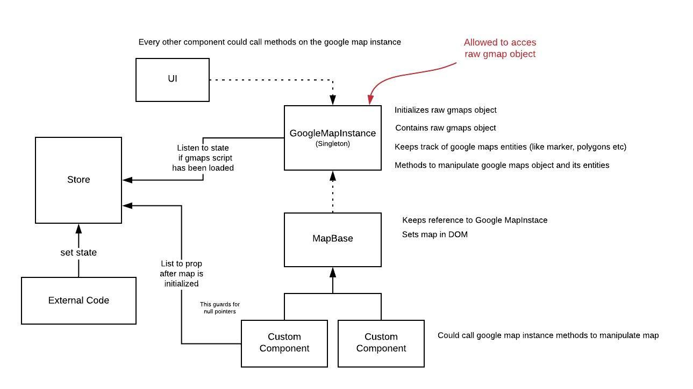

# Finding  X MEN - The Right Direction

<p align="center">
    
</p>

So far we have dealt with a method wrapper and the store this article focuses on combining both to come up with an 
infrastructure to easily create custom map components.

### Basic Infrastructure

// TODO simplify diagram
<p align="center">
    
</p>

*GoogleMapsInstance*  
Class for manipulating the raw google maps object with its methods (discussed in the first post // TODO link here)

*Store*  
Used as a single source of truth for the data of this application which uses Rxjs observables for listening to changes.

*MapBase*  
This class will be used to initialize the `GoogleMapInstance` after the map has been loaded, put the google map in the DOM, 
and pass on marker click events to its children.

*Custom Map Component*  
When first mentioned points are in place then this is where the magic happens. It will extend the MapBase so that it does
not have to do all that stuff itself. To get a new map component you only have to extend from MapBase and that's it.
You could do some map config and have some listeners. The nice thing about this is that the your custom component will only
be called after the map has been loaded thus the googleMapInstance is garantueed and you can remove those pesky undefined
checks. 


#### Custom Component

If you add such a class it will generate a whole new map object and renders it in the DOM automatically. Super easy and without
duplicate code in your app when you have multiple maps in your application on different pages.

```
// Extends the MapBase to get its functionality 
export class XMenMap extends MapBase{
    
    constructor(){
        // Pass to the MapBass an html element you want this map to be rendered in
        const xmenMapContainer = document.querySelector('#xmen-map');
        super(xmenMapContainer);
    }

    // Click handler that will be called when a marker of this map has been clicked
    markerClicked(marker: MutantMarker): void {
        //do something when marker has been clicked on map
    }
}

// When you create the object it will create the whole map with its cycle
new XMenMap();
```

#### Map Base
The MapBase does the heavy lifting like initializing the `GoogleMapInstance` after the map script has loaded,
rendering the map and providing some util functions. An important thing is that it sets itself as the context in the instance. 

```
export class MapBase implement IMap {
    private setupMap() {

        // Initializes the GoogleMapsInstance when creates
        initGoogleMaps();
        this.googleMapsInstance.setContext(this);

        // This element will be the passed on html element from its child
        this.element.appendChild(googleMapsInstance.el);
    }
}
```

```
export class GoogleMapsInstance {
    private context: IMap;
    
    public setContext(context: MapBase): void {
        this.context = context;
    }

    private addMarker(marker: MutantMarker): void {
        marker.addListener('click', this.markerClickHandler.bind(this, marker));
    }

    markerClickHandler(marker: MutantMarker){
        this.context.markerClicked(marker);
    }
    ...
}
```


This way you can create really fast new map components. Then you can use to MapBases method to quickly
hook up with google maps.

The MapBase is responsible for putting the googlemaps in the DOM

### Map Base in depth

// TODO schema how the methods are being called after loading and initialize
// with store

```
export interface IMap {
    doMapInitLogic(): void;
    markerClicked(marker: MutantMarker): void;
    afterMapInit(): void;
}

export class MapBase implements IMap{
    ...
}
```

```
// src/app/store.ts

private state: State = {
    mapLoaded: false,       // indicates if the external gmaps script has been loaded
    mapInit: false,         // indicates if the google maps has been initialized
};
```

Describe flow from script loading to mapbases functions with diagram?

Uses articles 2 `firstTimeTrue` store utils function

```
// src/app/map/MapBase.ts

constructor(private element){
    if(!this.element) throw Error('html element required for MapBase');

    const mapLoaded = firstTimeTrue('mapLoaded')
    const mapInit = firstTimeTrue('mapInit');

    mapLoaded.subscribe( this.afterMapLoaded.bind(this));
    mapInit.subscribe( this.afterMapInit.bind(this));
}
```

### Timeout

Extend upon above constructor with external gmaps script loading timeout

```
// src/app/map/MapBase.ts

constructor(private element){
    if(!this.element) throw Error('html element required for MapBase');

    // timeout stream
    const TIMEOUT = 5000;
    const timer$ = timer(TIMEOUT).pipe(
        tap( x =>  {
            throw new Error(`Map took too long to load!, timeout is ${TIMEOUT}`)
        })
    );
    const mapLoaded = firstTimeTrue('mapLoaded').pipe(takeUntil(timer$));
    const mapInit = firstTimeTrue('mapInit');

    mapLoaded.subscribe( this.afterMapLoaded.bind(this));
    mapInit.subscribe( this.afterMapInit.bind(this));
}
```

Setupmap
```
// src/app/map/MapBase.ts

private afterMapLoaded(){
    this.setupMap();
    this.doMapInitLogic();
}

private afterMapInit(){

}

private setupMap() {
    initGoogleMaps();
    this.googleMapsInstance = googleMapsInstance;
    this.googleMapsInstance.setContext(this);
    this.element.appendChild(googleMapsInstance.el);
}

protected mapIsInitialized(): void {
    Store.set('mapInit', true);
}
```

Uses articles 2 `changedButWaitFor` store utils function


###Listening to map related props

```
// src/app/map/MapBase.ts

protected listToPropAfterMapInit = (prop: any, ...rest) => {
    const params = [
        prop,
        ...rest,
        'mapInit'
    ];
    return changedButWaitFor.apply(null, params);
};
```

#Custom map component
```
export class XMenMap extends MapBase{

    constructor(){
        // the container div where to map is going to be put in
        const xmenMapContainer = document.querySelector('#xmen-map');
        super(xmenMapContainer);

        this.listToPropAfterMapInit('prop1').subscribe((val: any) => {
            // do something after prop1 changes but only after the map has been initialized
        });
    }
    
    // overrides the MapBase' doMapInitLogic()
    doMapInitLogic(): void {
        //you could here do some initializing on the google maps

        // this lets the store know that map has been initialized
        // once this has been called then every listToPropAfterMapInit observers
        // finally be called
        this.mapIsInitialized();    
    }

    markerClicked(marker: MutantMarker): void {
        // do something when markers has been clicked on map
    }

}
```


    
### Markers

We will go into the mutant specifics in the next and last article. But these typescript interfaces are used when 
creating markers. 

```
// src/app/map/markers.ts

export enum MutantType {
    Alpha = 'Alpha',
    Beta = 'Beta'

    // ... next post adding more types
}

```

```
// src/app/map/markers.ts

export interface MutantMarker extends google.maps.Marker {
    data?: {
        mutant?: Mutant;
        mutantType: MutantType;
    };
}
```

#### Creating markers (factories)

```
// src/app/map/markers.ts

const createMarker = (lat: number, lng: number, mutantType: MutantType, options: google.maps.MarkerOptions = {}): MutantMarker => {
    let markerOptions = defaultMarkerOptions(lat, lng);
    markerOptions = {
        ...markerOptions,
        ...options,
    };

    const marker: MutantMarker = new google.maps.Marker(markerOptions);
    marker.data = {
        mutantType: mutantType,
    };
    return marker;
};
```


Creating an AlphaMutant marker example

```
// src/app/map/markers.ts

export const createAlphaMutant = (mutant: Mutant): MutantMarker => {
    const icon: google.maps.Icon = {
        url : `../../assets/${mutant.img}`,
        scaledSize: new google.maps.Size(70, 70),
        anchor: new google.maps.Point(35, 40),
        labelOrigin: new google.maps.Point(0,0)
    };

    const markerOptions: google.maps.MarkerOptions = {
        icon,
        label: `${mutant.name}`,

    };

    // calls the above generalized createdMarker factory
    const marker: MutantMarker = createMarker(mutant.location.lat, mutant.location.lon, MutantType.Alpha, markerOptions);
    marker.data = {
        ...marker.data,
        mutant: <Mutant>{
            ...mutant,
        },
    };
    return marker;
};
```

Why did we add types with the factory to create a marker?

With those types you can easily make function to group those markers together.
For example if you have many mutant types and you want to define with one function call
if the input marker is a discoverable mutant. Those function keeps conditional marker checken
maintainable and flexible.

The input param marker is a marker on google maps, which you created with one of the factories

```
// src/app/map/markers.ts

export const isDiscoverableMutant = (marker: MutantMarker): boolean => {
    return(
        marker.data.mutantType === MutantType.Alpha ||
        marker.data.mutantType === MutantType.Beta
    );
};
```

Every you want to check if a marker is discoverable you call this function.

```
// src/app/map/GoogleMapInstance.ts

if(isDiscoverableMutant(marker)){
    //... do something that is only intended for discoverable mutant markers
}
```


#### Adding markers

The marker will be set to invisible when first put on the map.

```
// src/app/map/GoogleMapInstance.ts

private markers: MutantMarker[] = [];

private addMarker(marker: MutantMarker): void {
    marker.addListener('click', this.markerClickHandler.bind(this, marker));
    this.markers = [
        ...this.markers,
        marker,
    ];
    marker.setVisible(false);
    marker.setMap(this.googleMaps);
}       
```

The functions `show` and `hide` will show or hide the markers with of the input `MutantType`
If no type has been given than it will show/hide all the markers. Through the separation of making markers
visible or not is handy so now you can load all marker in memory and on the map. Later you can show or hide
the ones you want. The map will feel more performant because it won't have to rerender the markers on the map all the 
time just hide or show existing once this is much faster.

```
// src/app/map/GoogleMapInstance.ts

public show(mutantType?: MutantType): void {
    this.markers.forEach( (marker: MutantMarker) => {
        if (!mutantType || marker.data.mutantType === mutantType) {
            marker.setVisible(true);
        }
    });
}

public hide(mutantType?: MutantType): void {
    this.markers.forEach( (marker: MutantMarker) => {
        if (!mutantType || marker.data.mutantType === mutantType)
            marker.setVisible(false);
    });
} 
```


    

    

