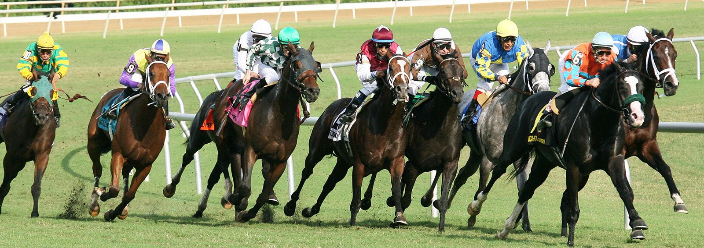
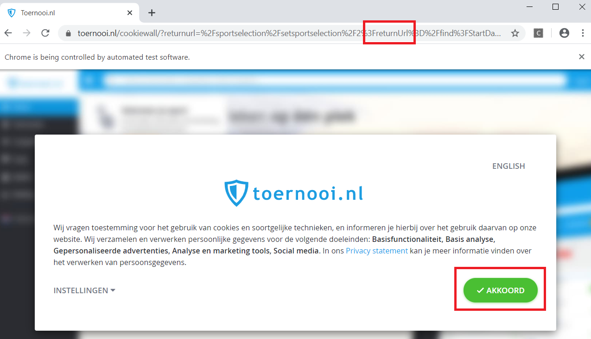
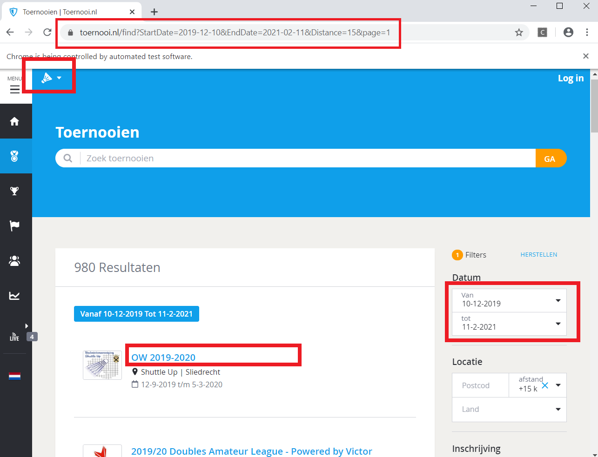
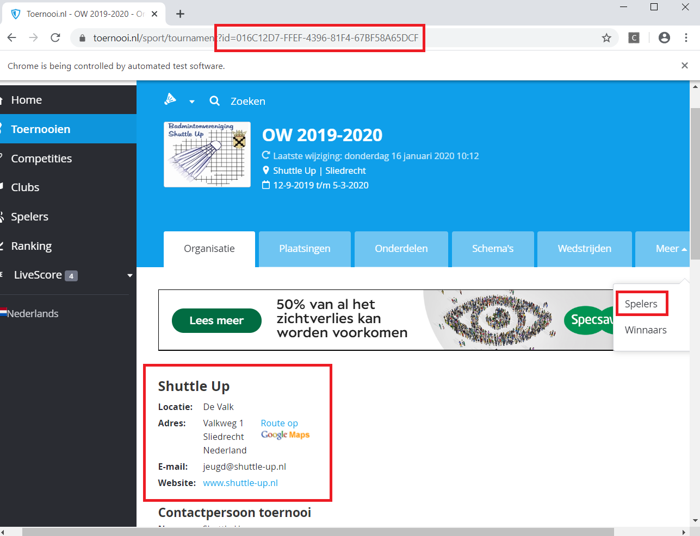
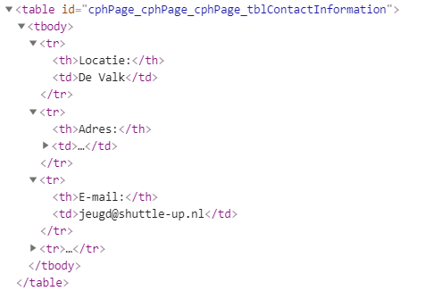
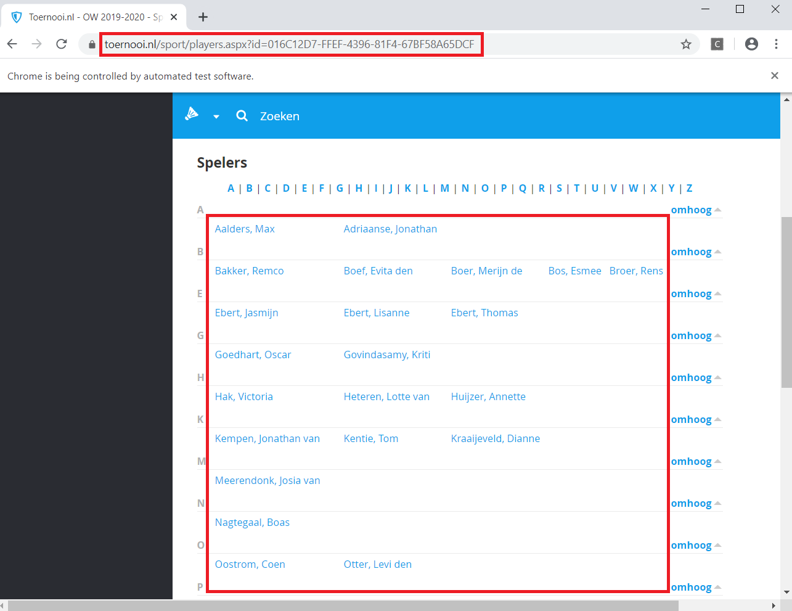
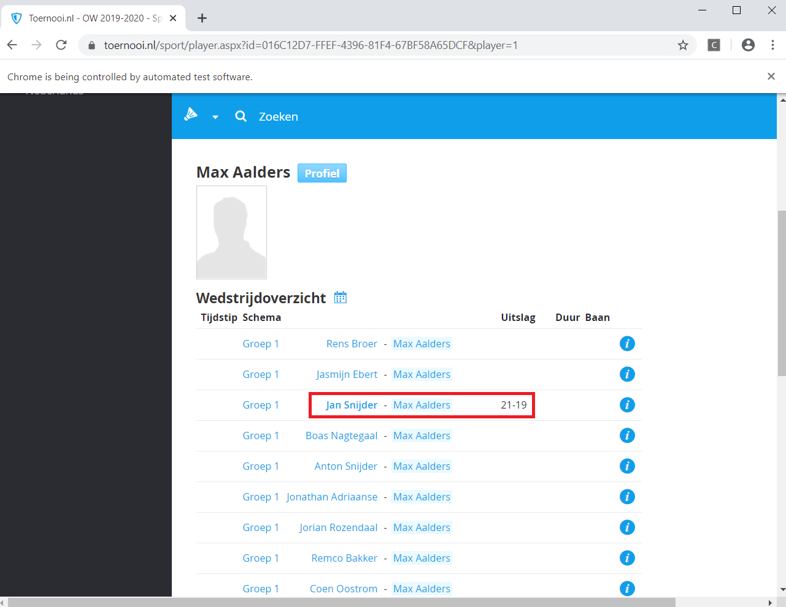
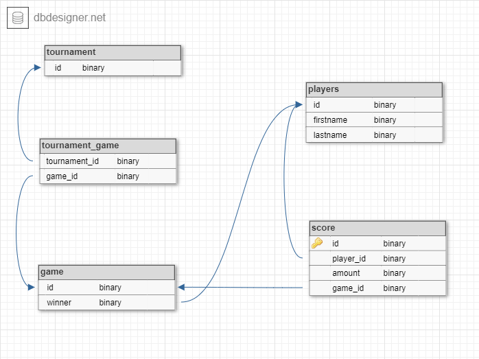
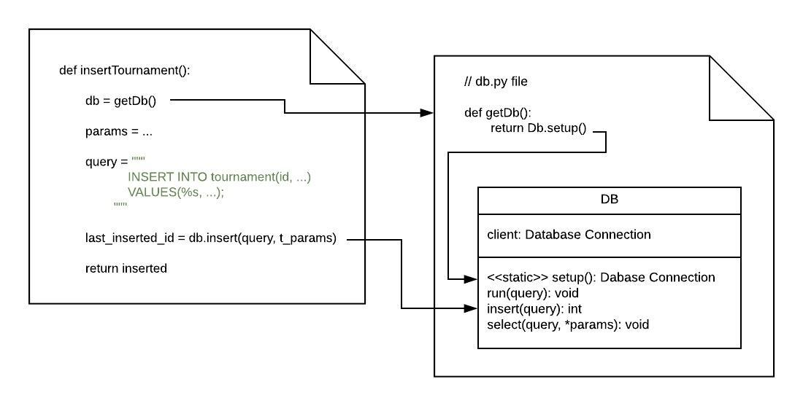

# Scraping the Web - Taking a Bet



For a while now the possibilities of machine learning have fascinated me. Though I was doing some for fun on the side I 
have decided too take it more seriously. By chance, with that thought in my mind, I have came across the company [Springco](https://www.spring-co.nl/) which
uses machine learning to get answers for urban related questions. 

After an inspiring conversation with Hank Groenhof and René Neijmeijer covering topics such as the steps taken
to get to an answer, statistics, neural nets and lastly how and where to get your data. It got me thinking.  

*Questions I am going to answer*

**What specific data do you want?**  
**How do you harvest data from a website if no off the shelf API exists?**    
**How do you want to store it and in which format?**  
**How could a data scientist use the harvested data?**

Because I used to play badminton in the previous days and have scoured the [https://www.toernooi.nl](https://www.toernooi.nl/tournaments) a lot for keeping track of 
matches I thought it would be fun to use that as a base for this case. It would have saved me a lot of time then if I had a
web scraper doing all the searching for me 😃.

**The code for this demo project could be found in this [Git repo](https://github.com/leonstel/techblog_scrape_the_web)**

## Use Case - Sports Betting

Recently sport betting is becoming legal in the united stated. Imagine that you are the owner of a sports club and 
wants to make some extra money. Your objective is: 

- Getting insights if betting on the tournaments held at my club is profitable

The first step to achieve this goal is to gather data related to this objective. So you figured that you should have a 
collection of **tournaments, players, games, scores and winners**. After hours maybe days of searching the web for an easy to 
consume API which has your exact data requirements mentioned previously you have come to the conclusion that it is a lost cause. 

Just before you are going to call it a day you come across the website [https://www.toernooi.nl](https://www.toernooi.nl/tournaments).
Which contains the exact information you need to get any answers, but it has a major drawback. It does not have a public 
API. So you have to come up with a solution to extract the data from that website involving **web scraping**.

## Solution in a Nutshell

This is the final web scraping solution which we are building up to.  

The scraper in action (sounds like a new Hollywood action blockbuster or a sequel of The Terminator).

<p align="center">
    <iframe src="https://www.youtube.com/embed/zhJYiblYazY" width="700" height="450" frameborder="0" allowfullscreen> </iframe>
</p>

- Scraping and saving to db the tournaments, its players and games. **(begin - 2:06)**
- Show resulted db tables in DataGrip db viewer **(2:06 - end)**

## Learning Points

These topics will join us on our epic journey. 

- Python and effective database connections
- Interactive Web Scraping
- Database design / querying

## Examine the Site

First of all, what does the site in question actually looks like and where can you find meaningful data? Remember that
you are a sports club owner examining if sports betting is profitable for you. You are looking into
betting for your badminton tournaments.

**What specific data do you want?** 

After clicking through millions of sites your eye fells upon [https://www.toernooi.nl](https://www.toernooi.nl/tournaments). 
You have a hunch that you need 
tournaments, its players, its games and the individual scores of each game. With that data you could go crazy like determining
how much a particular club wins, know if age plays a part either and other feature like things you can come up with. These
entities are good ground to get your creativity and data scientist instincts running.  

| Entity | Relations |
| ------------- | ------------- |
| Tournament | Has many Games  |
| Game  | Belongs to only one Tournament, has one Player as winner  |
| Player | Could be a winner to many Games  |
| Score | A Game consists of many scores, a Score can have one player  |

The data becomes more meaningful if you capture the relationships between each entity. That's why we are going to use
a database and not formats like csv. After the examination we will go deeper into the database area. 

**How do you harvest data from a website if no off the shelf API exists?**    

Oh no, this site does not give away a public api for easy data consuming. The main question you ask yourself: is data scraping worth it?
Yes, I believe it is valuable if you want to get some, for you invaluable, resource into your own application or workflow somehow. 

In our journey we have to use two techniques to get the targeted data from the site.

*Programmatic interactive browsing*  
To get to the data we have to navigate through the site like a normal user. Think of actions such as accepting a cookies
popup, searching by interacting with search inputs and navigating deeper by selecting the url of a player.  

*Extracting from the page source*  
This is the part that actually parses the page source of the current visited page. Common things are searching for particular
elements within the HTML DOM, looping over table rows and getting meta attributes from html tags.

*Python tools*
- Selenium <sub>(interactive browsing)</sub>
- BeautifulSoup <sub>(page extracting)</sub>

Every thought process and technique could be used for every other site, but the actual coding I am going to do will be 
working for this site only. Other sites consists of other structures and other HTML markup.

### Cookies Popup ###

The first thing you will encounter is the 'accepting cookies popup'.

<p align="center">
    
</p>

I discovered that you could control the url which it will be going to, after accepting, with the `returnUrl` query parameter.
So we as web scrapers are going to fill that in to suit our needs.

Our returnUrl:
`/find?StartDate={}&EndDate={}&CountryCode=NED'`
This will navigate to the tournament search page. If you add the `StartDate` and `EndDate` as query parameters it will fill in these two
search inputs and starts searching with these dates automatically.

```
# Import selenium python package
from selenium import webdriver

# We are going to use chrome because Chrome rocks
browser = webdriver.Chrome()

# The url we want to visit, cookies will first popup and then go the the returnUrl afterwards
url = 'https://www.toernooi.nl/sportselection/setsportselection/2?returnUrl=/find?StartDate={}&EndDate={}&CountryCode=NED'

# The start and end date variables to be included within the url to get all tournaments between these dates
startDate = '2019-12-10'
endDate = '2019-12-31'

# Fill the variable values into the url string
url = url.format(startDate, endDate)

# At last visit tell selenium to go to this url
browser.get(url)
```

After visiting this url with `selenium` the cookies popup comes up. We will have to search for the button and programmatically click it to go 
further with our adventure. After clicking, it will redirect the page to the `returnUrl`

```
# Find the accepting button with selenium
# It finds the button by its inner text with this command 
cookieButton = browser.find_element_by_xpath("//*[text()='Akkoord']")

# And then click it progammatically
# It wil then go to the returnUrl (this is how the site works)
cookieButton.click()
```

### Tournaments search results ###

So we are off on the right foot. To move on this is our next page with useful information. As you can see it redirected
to our return url and searched for tournaments between our specified dates. 

<p align="center">
    
</p>

At the right you see the dates filled in automatically. In the url I have specified the sports type as well (as badminton).
At the upper left corner you see that it has selected the sports type as badminton. 

The thing that we are after is the
third and not yet mentioned red box, it is the tournament's url. It contains valuable information namely the tournament's id
and the url to get to the tournament's detail page. The detail page contains its info, players and games.

```
// main.py

from bs4 import BeautifulSoup   # page extracting tool
import globals                  # my own file for  storing global variables
import extraction               # my own file for extraction methods
```

The previous code to bypass the cookies popup has been placed in a function `allowCookies`

```
# The code to accept the cookies
allowCookies()

# 2 second sleep. Otherwise the expected page could be not fully loaded yet
time.sleep(2)

# Let the beautiful soup consume the current page source
# We can then later on use its api to easily get elements and data out of it
# Globals is the file where the global variables are stored
soup = BeautifulSoup(globals.browser.page_source, 'html.parser')

# Function to get a list of all the tournament urls from the pages
tournament_urls = extraction.extractTournamentUrls(soup)
```

So lets get started to do some page extraction. The `extracyTournamentUrls()` gets all tournament details urls and
returns a list of them. Before writing the extracting code of this page you will have to inspect the html contents.
Pinpoint which elements you need and find characteristic of the html tag to identify that specific part(s) of the
html DOM. Common things used for searching are `classes`, `ids`, `html tag names` and `html tag attributes`.

Example

```
<div id='tournament_1' class='tournament' location='dordrecht' attr2='test'></div>
<div id='tournament_2' class='tournament' location='sliedrecht' attr3='test2></div>

- Ids are 'tournament_1' and 'tournament_2'     
- Classes are 'tournament'
- Html tag name is 'div'
- Html attribute are 'location', 'attr2' and 'attr3' 
```

The part of the html DOM we are interested in. Below it the simplified structure of the tournaments search results.

We are after the tournament's url and want to know its id.

- We want the ul tag with id `searchResultArea`
- Get all its li elements with class `list__item`
- Get the a tag of the li
- Get the value of the a's `href` attribute

```
<ul id='searchResultArea'>
    <li class='list__item'>
        <a href='https://www.toernooi.nl/sport/tournament?id=016C12D7-FFEF-4396-81F4-67BF58A65DCF'>OW 2019-2020</a></li>
    <li class='list__item'>
        <a href='https://www.toernooi.nl/sport/tournament?id=FBC5194B-BF9C-487F-A2D9-1E151B0650D8'>Clubkampioenschappen 2020</a>
    </li>
    ... more li
</ul>
```

The function laid out.

```
// extraction.py

# Get the tournament details from page
# The soup param is the page source wrapped within the BeautifulSoup api
def extractTournamentUrls(soup):

    # Find the html <ul> element that has an id of #searchResultArea
    searchResultUl = soup.find("ul", {"id": "searchResultArea"})

    # When the ul has been found get all of its li html element
    # In our case the li elements contain the tournament links
    tournament_list = searchResultUl.findAll("li", {"class": "list__item"})

    urls = []

    # Loop over every <li> element
    for t in tournament_list:

        # Find the <a> element and get href url from its attribute
        tournament_a = t.find("a")
        if tournament_a:
            tournament_link = tournament_a.attrs.get('href')
            urls.append(tournament_link)

    return urls
```

### Tournament Detail ###
<p align="center">
    
</p>

The DOM of the tournament info

<p align="center">
    
</p>

Will will loop through the previously extracted tournament url list like:
```
for index in range(len(tournament_urls)):
    # ... do something with tournament url
```

Code inside loop does something with the url on each iteration.

```
#Python's regex module
import re

# Use Regex the extract the tournament's id from the url

result = re.search(r"id=((\w+-?)+)", tournamentUrl)
tournament_id = result.group(1)

# Visit the tournament's detail page 
# Check the code base for the abstraction method)
# The method does the navigational thing with selenium discussed for the first page

soup = globals.goToUrl('https://www.toernooi.nl{}', tournament_urls[index])
extraction.extractTournamentInfo(soup, tournament_id)
```

This is the tournament's info we are interested in.
```
# enum for the tournament's information on its detail page
class TournamentAttr(Enum):
    LOCATION = "locatie"
    ADDRESS = "adres"
    PHONE = "telefoon"
    EMAIL = "e-mail"
    WEBSITE = "website"
    FAX = "fax"
```

The function laid out to extract a tournament from above html DOM. After extracting it will be inserted into the database.

```
// extraction.py

# db.py file contains helper methods to interact with the database
import db       
...

# The tournament_id param has been extracted from the tournament's detail url (the id query param)
def extractTournamentInfo(soup, tournament_id):

    # Find the correct html elements
    table = soup.find("table", {"id": "cphPage_cphPage_cphPage_tblContactInformation"})
    tbody = soup.find("tbody")
    rows = tbody.findChildren("tr", recursive=False)

    # Get the tournament's info from the elements
    entry = {}

    for row in rows:

        entry['id'] = tournament_id

        attribute = row.find('th').getText().replace(":", "").lower()
        data = row.find('td').getText()

        if TournamentAttr(attribute) == TournamentAttr.LOCATION:
            entry['location'] = data

        elif TournamentAttr(attribute) == TournamentAttr.ADDRESS:
            address_td = rows[1].find('td').find('td').contents
            data = [content for content in address_td if getattr(content, 'name', None) != 'br']
            entry['address'] = data

        elif TournamentAttr(attribute) == TournamentAttr.PHONE:
            entry['phone'] = data

        elif TournamentAttr(attribute) == TournamentAttr.FAX:
            entry['fax'] = data

        elif TournamentAttr(attribute) == TournamentAttr.EMAIL:
            entry['email'] = data

        elif TournamentAttr(attribute) == TournamentAttr.WEBSITE:
            entry['website'] = data

        else:
            print('Attribute not found!!!', attribute)
    
    # Save tournament info to db (helper method from db.py)
    db.insertTournament(entry)
```

### Tournament Players ###
<p align="center">
    
</p>

First of all, we navigate to the players of the tournament. In previous sections we have extracted the tournament ids from
the detail url with a Regex. It happens that when you navigate to `https://www.toernooi.nl/sport/players.aspx?id={tournament_id_here}` 
you will go to the players overview page of that tournament. We have done code wise navigation many times earlier, so I
am not going to show it again here.

Like previous page the pinpointed data is located within a table and the table cells contain the players detail links. 
The more interesting things of this part is how can you extract the raw player names to a format you can use within a database? 

**Regex Name Extraction**  
Regex is a nice tool to extract patterns and groups from a raw string, so this is what we are going to use to distill the 
raw player name to different units such as **first name**, **prefix** and **last name**

The simple regex which is used within code just looks if there is a comma within the string. If so get the word located
in front of the comma as last name and the whole part after the comma as first name.  
`(\w+), (\w+)(.*)`

Although this worked on the tournament being tested I quickly found out that it broke with other names. In particular 
the more foreign names didn't have a comma
separation . On the other side, Dutch people love prefixes like van, van der, de etc in there names. The
above regex wasn't keen on finding these separately either.

**More Complex Regex**  
Example names from different tournaments and there preferred extraction.

| Raw HTML | First name | Prefix | Last name |
| ------------- | ------------- | ------------- | ------------- |
| Aarav  | **Aarav**  | **null** | **null** |
| Aarika Ann Jithu  |  **Aarika Ann Jithu**  | **null** | **null** |
| Adlyn Mary Sojan  | **Adlyn Mary Sojan**  | **null**  | **null** |
| Kempen, Jonathen  | **Jonathen**  | **null** | **Kempen**  |
| Kempen, Jonathen van  | **Jonathen**  | **van** | **Kempen**  |
| Kempen, Jonathen van de  | **Jonathen**  | **van de** | **Kempen**  |

Below the more complex regex that is able to extract above data  
```((?(?=,))(\w+), (\w+)(.*)|.*)```

You could test it out at [https://regex101.com/r/1lwQEF/17](https://regex101.com/r/1lwQEF/17) which contains the above 
test data as well.

The reason that I haven't used the more complex variant within python is because its engine does not support 
conditional regex statements yet. And to get it working with some hacky work around wasn't the purpose while writing this
code project.

**Player ID Cache**  
Another thing I stumbled upon is that other code will have to access the database's inserted players for their ids.
The performance went down quickly because of doing thousands and thousands `SELECT` queries on the database. So I have 
saved them right after the database insert into a dictionary, the cache principle. The performance has gone up many times.

The players table extraction code.
```
// extraction.py

def extractPlayers(soup):
    
    # Like before find the table with beautiful soup this time with a class of players
    table_players = soup.find("table", {"class": "players"})
    tbody = table_players.find("tbody")

    # Find the individual table cells
    tds = tbody.findAll("td")
    
    # Loop over every table cell
    for td in tds:

        # Find the <a> link tag within each cell (which contain the player's name and url)
        link = td.find("a")
        if link:

            entry = {}

            # Get the player detail url from its href attribute
            player_url = link.attrs.get('href')
            player = link.getText()


            # Uses the simple Regex not the complex one (described above why)
            result = re.search(r"(\w+), (\w+)(.*)", player)

            # If no correctly formatted name found skip this iteration
            if not result or (not result[2] or not result[1]):
                continue

            # Shape the variables from the regex output
            firstname = result[2].lstrip()
            lastname = result[1].lstrip()
            prefix = result[3].lstrip()

            # The last name will include the prefix if it extists
            lastname = prefix + ' ' + lastname if prefix else lastname

            entry['firstname'] = firstname
            entry['lastname'] = lastname

            # Save the player into the database through one of my database helper methods
            # Check the code base to see the actual data base code

            last_inserted_player_id = db.insertPlayer(entry)

           # After insterting save the player's database id to a dictionary for quick access later on

            player_id_cache_key = entry['firstname'] + ' ' + entry['lastname']
            globals.player_id_cache[player_id_cache_key] = last_inserted_player_id
```

### Player Detail ###
As you can see, after navigating to the player's detail page, there is a list of matches to whom the player has played
against within current tournament. We are after the matches's scores and opponent players. 

For every player the `extractMatches()` will contain the logic for extracting this detail page. It finds out who the 
opponent player is and it extracts the played scores. A game could consist of many scores, `21-19` will become a score entry
with 21 points and another one with 19 points. The one with the highest score will be set as the winner
for that game.

<p align="center">
    
</p>

Nothing fancy, just navigating to the player's detail page.

```
print('visit matches page of the player')
url = 'https://www.toernooi.nl{}'
soup = globals.goToUrl(url, player_url)

# After navigating extract the matches from the player's detail page
extractMatches(soup)
```

To extract the raw score strings like `21-15` to two separate units such as `21` and `15` we are going to use this regex 
`((\d+)-(\d+))`. 

At last the matches will be saved in memory so that they could be processed later on. This is done so that all players used
within the matches has been inserted in the database before they are being accessed. 

```
// extraction.py

import re
import globals
...

def extractMatches(soup):
   
    # Find <table> element on page
    table_matches = soup.find("table", {"class": "matches"})

    if table_matches:
        tbody = table_matches.find("tbody")
        rows = tbody.findAll("tr", recursive=False)

        # Loop over all table rows
        for row in rows:

            entry = {}

            # Find all the table cells of this row
            tds = row.findAll("td", recursive=False)

            # The 7the item contains the scores like '21-19', get the raw text.
            game_scores = tds[6].getText()

            if game_scores:

                # The 3rd table cell contains entire opponents name
                contestant1 = tds[3].getText().strip('\n').lstrip()

                # The 5th table cell contains the entire current player's name
                contestant2 = tds[5].getText().strip('\n').lstrip()

                # Use regex to get the separate score units from a string like '21-15'
                result = re.search(r"((\d+)-(\d+))", game_scores)

                if not result:
                    continue

                score1 = result[2]
                score2 = result[3]

                # for now only one game
                entry['contestant1'] = contestant1
                entry['contestant2'] = contestant2
                entry['score1'] = int(result[2])
                entry['score2'] = int(result[3])

                # Determine the winner of the game (the one with the highest score of the two)

                winner = None
                if entry['score1'] > entry['score2']:
                    winner = contestant1
                else:
                    winner = contestant2

                entry['winner'] = winner

                # Save the matches to a pandas dataframe so that they could be processed later on by the processMatches function
                globals.matches_df = globals.matches_df.append(entry, ignore_index=True)
    else:
        print('Not match table found!')
```

### Finishing up Matches ###

The final step is to process the saved matches. Processing means here getting the data from memory and putting it correctly
into the database. The `extractMatches()` has saved the matches it found to the `matches_df` global variable.

```
// globals.py

matches_df = pd.DataFrame()
```

Loop over the cached matches and insert the Score and Game database entries properly. Don't forget to properly link
the entries, that's why we used Postgres DB in the first place!

This is the place where the earlier cached player_id comes in handy. Without this id cache you would have to do hundreds
and hundreds of player `SELECT` database queries, performance wise a killer.

```
// extraction.py

# The processing of matches happens when all other extracting has been done
# it takes and saves the matches to the database. It uses with that the cached player ids
# without the cached player ids it should do a ton of unnecessary select database queries. You should avoid that!
def processMatches(tournament_id):
    print('process the saved matches, save to db with cached player ids')

    for index, match_row in globals.matches_df.iterrows():

        contestant1 = match_row['contestant1']
        contestant2 = match_row['contestant2']

        # get the player ids from the player_id_cache and use them for saving the match to databse
        # the match needs the player ids from its relation with the players table
        
        if contestant1 in globals.player_id_cache and contestant2 in globals.player_id_cache:
            contestant1_id = globals.player_id_cache[match_row['contestant1']]
            contestant2_id = globals.player_id_cache[match_row['contestant2']]
            score1 = match_row['score1']
            score2 = match_row['score2']
            winner_id = globals.player_id_cache[match_row['winner']]

            #  save the game to the database
            game_id = db.insertGame(tournament_id, winner_id)

            if game_id:

                # after saving the game insert 2 score entries to the database
                # those will be linked to the game by its id and with a player by its cache player id
                
                db.insertScore(game_id, contestant1_id, score1)
                db.insertScore(game_id, contestant2_id, score2)
            else:
                print('Could not save game to DB!')
```

## Database 

**How do you want to store it and in which format?**  

Maybe you have guessed it, but we have stored our data into a **database**. There are other formats that come by very 
often such as excel and csv. 

I believe that databases are really good for capturing relationship in comparison with excel and csv. On top of that databases
provide handy query languages to easily get and manipulate the data the way you want it.

**Postgres** is the database type I have used for this project other databases like MySql, SQLite are good as well. 
Postgres is just my preferred one and has some nice features which the others do not have. 

##### Design

Design is everything when working with databases. In our case the scraped data from the website is being saved to this structure, 
whereas every entity is getting linked appropriately. It is important to think about your data and how the relations
should be before you start to code. 

When we have started examining the site we have thought about what data we want and how that
data relates to each other.

<p align="center">
    
</p>

| Entity | Relations |
| ------------- | ------------- |
| Tournament | Has many Games  |
| Game  | Belongs to only one Tournament, has one Player as winner  |
| Player | Could be a winner to many Games  |
| Score | A Game consists of many scores, a Score can have one player  |

#### Implementation

**Migration**

So you have it all figured out, don't you?! Now what. The first thing I did is translating the design to a migration file.
This means telling the database to create the tables like the structure you have seen above. Once you run that sql file
you will end up with an empty database with the specified structure.

How a raw query migration file looks like. The entities are linked with foreign keys.

```
// sql/migration.sql

CREATE TABLE tournament (
    id UUID PRIMARY KEY,
    location VARCHAR(255),
    address VARCHAR(255),
    phone VARCHAR(255),
    email VARCHAR(255),
    website VARCHAR(255),
    fax VARCHAR(255)
);

CREATE TABLE games (
    id SERIAL PRIMARY KEY,
    tournament_id UUID,

    -- being linked to tournament
    FOREIGN KEY (tournament_id) REFERENCES tournament(id),

    -- ... other fields      
);

-- ... create the other tables here 

```

**Structure**  

Secondly you want to set up a coding structure to easily run queries against your database with python. I have come up
with a structure to effectively run queries python wise on a database without having to duplicate much code every time you run 
basic queries. 

Look at the code base if you want to go more into depth on this subject.

<p align="center">
    
</p>

## Data Scientist   

**How could a data scientist use the harvested data?**

All data has been gathered successfully and could now be utilized for some magic. Think of a database query, execute it,
retrieve the result and then use the result with pandas, numpy or any other python technique. 

Because databases have already strongly typed fields that takes some of the sanitization off your hands.
But you will always have to post process the data one more time before putting them into your machine learning models.

Example query which does some basic selecting, but you could go crazy with the data. 

```
select *
from tournament
inner join games on (tournament.id = games.tournament_id)
inner join players on (games.winner = players.id)
inner join scores on (games.id = scores.game_id)
where tournament.id = '016c12d7-ffef-4396-81f4-67bf58a65dcf'
```

## Afterthought

One thing that is important to note is that sites get updated regularly nowadays. This means that the site you are 
scraping could have changed its html code structure drastically by some future update.
While writing this article I have encountered such an update on the html which broke the code.
So it is always a good practice to have some decent error handling / logging for monitoring.

## Fitting the Pieces

To recap, we have gone through a lot with multiple scraping techniques and how the harvest could be stored. Now you know how you 
could get some data of a source which does not have an off the shelf api.

Alongside that there has been shed some light on how to structure python code to efficiently run queries against a database.
I hope you have learned a thing or two :)

#### Git Repo / Source Code
[Scrape the Web git repo](https://github.com/leonstel/techblog_scrape_the_web)

#### More Blogs
[Home](http://leonstel.github.io/)
