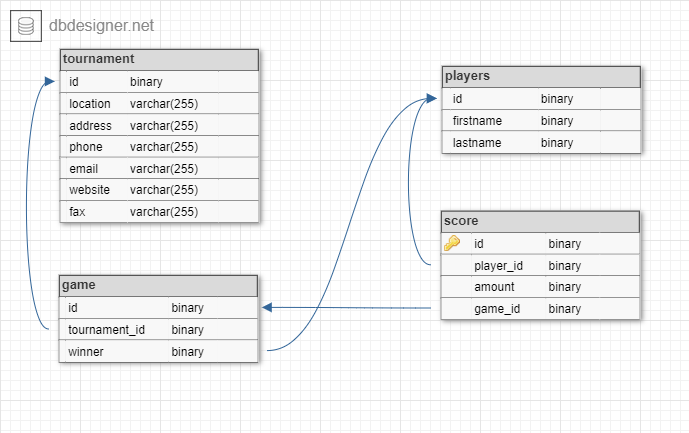

# Scraping the Web - Taking a Bet


For a while now the possibilities of machine learning have fascinated me. Though I was doing some for fun on the side I 
have decided too take it more seriously. By chance, with that thought in my mind, I have came across the company [Springco](https://www.spring-co.nl/) which
uses machine learning to get answers for urban related questions. 

After an inspiring conversation with Hank Groenhof and René Neijmeijer covering topics such as the steps taken
to get to an answer, statistics, neural nets and lastly how and where to get your data. It got me thinking.  

*Questions I am going to answer*

**What specific data do you want?**  
**How do you harvest data from a website if no off the shelf API exists?**    
**How do you want to store it and in which format?**  
**How could a data scientist use the harvested data?**

Because I used to play badminton in the previous days and have scoured the [https://www.toernooi.nl](https://www.toernooi.nl/tournaments) a lot for keeping track of 
matches I thought it would be fun to use that as a base for this case. It would have saved me a lot of time then if I had a
web scraper doing all the searching for me 😃.

## Use Case - Sports Betting

Recently sport betting is becoming legal in the united stated. Imagine that you are the owner of a sports club and 
wants to make some extra money. Your objective is: 

- Getting insights if betting on the tournaments held at my club is profitable

The first step to achieve this goal is to gather data related to this objective. So you figured that you should have a 
collection of **tournaments, players, games, scores and winners**. After hours maybe days of searching the web for an easy to 
consume API which has your exact data requirements mentioned previously you have come to the conclusion that it is a lost cause. 

Just before you are going to call it a day you come across the website [https://www.toernooi.nl](https://www.toernooi.nl/tournaments).
Which contains the exact information you need to get any answers, but it has a major drawback. It does not have a public 
API. So you have to come up with a solution to extract the data from that website involving **web scraping**.

## Solution in a Nutshell

This is the final web scraping solution which we are building up to.  

The scraper in action (sounds like a new Hollywood action blockbuster or a sequel of The Terminator).

<p align="center">
    <iframe src="https://www.youtube.com/embed/zhJYiblYazY" width="700" height="450" frameborder="0" allowfullscreen> </iframe>
</p>

- Scraping and saving to db the tournaments, its players and games. **(begin - 2:06)**
- Show resulted db tables in DataGrip db viewer **(2:06 - end)**

## Learning Points

These topics will join us on our epic journey. 

- Python and effective database connections
- Interactive Web Scraping
- Database design / querying

## Examine the Site

First of all, what does the site in question actually looks like and where can you find meaningful data? Remember that
you are a sports club owner examining if sports betting is profitable for you. You are looking into
betting for your badminton tournaments.

**What specific data do you want?** 

After clicking through millions of sites your eye fells upon [https://www.toernooi.nl](https://www.toernooi.nl/tournaments). 
You have a hunch that you need 
tournaments, its players, its games and the individual scores of each game. With that data you could go crazy like determining
how much a particular club wins, know if age plays a part either and other feature like things you can come up with. These
entities are good ground to get your creativity and data scientist instincts running.  

| Entity | Relations |
| ------------- | ------------- |
| Tournament | Has many Games  |
| Game  | Belongs to only one Tournament, has one Player as winner  |
| Player | Could be a winner to many Games  |
| Score | A Game consists of many scores, a Score can have one player  |

The data becomes more meaningful if you capture the relationships between each entity. That's why we are going to use
a database and not formats like csv. After the examination we will go deeper into the database area. 

**How do you harvest data from a website if no off the shelf API exists?**    

Oh no, this site does not give away a public api for easy data consuming. The main question you ask yourself: is data scraping worth it?
Yes, I believe it is valuable if you want to get some, for you invaluable, resource into your own application or workflow somehow. 


- Interactive parts
- Scraping parts

Cookies
<p align="center">
    
</p>

```
from selenium import webdriver

browser = webdriver.Chrome()

cookieButton = browser.find_element_by_xpath("//*[text()='Akkoord']")
cookieButton.click()
```

Tournaments search results
<p align="center">
    
</p>

```
// main.py
from bs4 import BeautifulSoup
import time
import globals
import extraction
...

url = 'https://www.toernooi.nl/sportselection/setsportselection/2?returnUrl=/find?StartDate={}&EndDate={}&CountryCode=NED'
startDate = '2019-12-10'
endDate = '2019-12-31'

# The code to visit a url and then getting page source will be abstracted with a function later on
url = url.format(*params)
browser.get(url)

allowCookies()

# 2 second sleep. Otherwise the expected page could be not fully loaded yet
time.sleep(2)

# globals is the file where the global variables are stored
soup = BeautifulSoup(globals.browser.page_source, 'html.parser')
tournament_urls = extraction.extracyTournamentUrls(soup)
```

Explain beautiful soup, first time here. Difference with selenium

```
// extraction.py

def extracyTournamentUrls(soup):
    print('get tournament urls from page')

    searchResultUl = soup.find("ul", {"id": "searchResultArea"})
    tournament_list = searchResultUl.findAll("li", {"class": "list__item"})

    urls = []

    for t in tournament_list:
        tournament_a = t.find("a")
        if tournament_a:
            tournament_link = tournament_a.attrs.get('href')
            urls.append(tournament_link)

    return urls
```

Tournament detail
<p align="center">
    
</p>

```
// extraction.py

#db.py file contains helper methods to interact with the database
import db       
...

# enum for the tournament's information on its detail page
class TournamentAttr(Enum):
    LOCATION = "locatie"
    ADDRESS = "adres"
    PHONE = "telefoon"
    EMAIL = "e-mail"
    WEBSITE = "website"
    FAX = "fax"

def extractTournamentInfo(soup, tournament_id):
    print('extract tournament info from page')

    table = soup.find("table", {"id": "cphPage_cphPage_cphPage_tblContactInformation"})
    tbody = soup.find("tbody")
    rows = tbody.findChildren("tr", recursive=False)

    entry = {}

    for row in rows:

        entry['id'] = tournament_id

        attribute = row.find('th').getText().replace(":", "").lower()
        data = row.find('td').getText()

        if TournamentAttr(attribute) == TournamentAttr.LOCATION:
            entry['location'] = data

        elif TournamentAttr(attribute) == TournamentAttr.ADDRESS:
            address_td = rows[1].find('td').find('td').contents
            data = [content for content in address_td if getattr(content, 'name', None) != 'br']
            entry['address'] = data

        elif TournamentAttr(attribute) == TournamentAttr.PHONE:
            entry['phone'] = data

        elif TournamentAttr(attribute) == TournamentAttr.FAX:
            entry['fax'] = data

        elif TournamentAttr(attribute) == TournamentAttr.EMAIL:
            entry['email'] = data

        elif TournamentAttr(attribute) == TournamentAttr.WEBSITE:
            entry['website'] = data

        else:
            print('Attribute not found!!!', attribute)

    
    # save tournament info to db (helper method from db.py)
    db.insertTournament(entry)
```

Tournament players
<p align="center">
    
</p>

```
// extraction.py

def extractPlayers(soup):
    print('extract players from page')

    table_players = soup.find("table", {"class": "players"})
    tbody = table_players.find("tbody")
    tds = tbody.findAll("td")

    for td in tds:
        link = td.find("a")
        if link:

            entry = {}

            player_url = link.attrs.get('href')
            player = link.getText()

            print('handler player ' + player)

            # check the blog's player' name regex section for additional info
            result = re.search(r"(\w+), (\w+)(.*)", player)

            if not result or (not result[2] or not result[1]):
                continue

            firstname = result[2].lstrip()
            lastname = result[1].lstrip()
            prefix = result[3].lstrip()
            lastname = prefix + ' ' + lastname if prefix else lastname

            entry['firstname'] = firstname
            entry['lastname'] = lastname

            print('save player to database')
            last_inserted_player_id = db.insertPlayer(entry)

            print('cache inserted player id')
            player_id_cache_key = entry['firstname'] + ' ' + entry['lastname']
            globals.player_id_cache[player_id_cache_key] = last_inserted_player_id
```

**regex names**
// python does not support regex conditional statements  
//it works on regex101 though https://regex101.com/r/1lwQEF/4  
//result = re.search(r"((?(?=,))(\w+), (\w+)(.*)|.*)", player)  
//name Kempen, Jonathan  
//and indonisian name laek surav aar oke  
// could be found on index 4

result = re.search(r"(\w+), (\w+)(.*)", player)

Tournament player detail
<p align="center">
    
</p>


For every player it calls, within the for loop of the `extractPlayers()`
```
print('visit matches page of the player')
url = 'https://www.toernooi.nl{}'
soup = globals.goToUrl(url, player_url)

extractMatches(soup)
```

```
// extraction.py

import re
...

def extractMatches(soup):
    print('extract matches from page')

    table_matches = soup.find("table", {"class": "matches"})

    if table_matches:
        tbody = table_matches.find("tbody")
        rows = tbody.findAll("tr", recursive=False)

        for row in rows:

            entry = {}

            tds = row.findAll("td", recursive=False)

            game_scores = tds[6].getText()

            if game_scores:
                contestant1 = tds[3].getText().strip('\n').lstrip()
                contestant2 = tds[5].getText().strip('\n').lstrip()

                result = re.search(r"((\d+)-(\d+))", game_scores)

                if not result:
                    continue

                score1 = result[2]
                score2 = result[3]
                # rawScore = result[1]

                # for now only one game
                entry['contestant1'] = contestant1
                entry['contestant2'] = contestant2
                entry['score1'] = int(result[2])
                entry['score2'] = int(result[3])

                winner = None
                if entry['score1'] > entry['score2']:
                    winner = contestant1
                else:
                    winner = contestant2

                entry['winner'] = winner

                print('save extracted match '+ score1 + '-' + score2 + ': ' + contestant1 + '-' + contestant2 +' to global variable')

                # save the matches to a pandas dataframe so that they could be processed later on by the processMatches function
                globals.matches_df = globals.matches_df.append(entry, ignore_index=True)
    else:
        print('Not match table found!')
```

Finishing up matches

The `extractMatches()` has saved the matches it found to the `matches_df` global variable. This is done because before you
can process the matches  the players must be process first. Now all the player are done and inserted into the database
now you can process the matches. The matches and its scores are linked to the player in some way. So the player
must exist in the database before you can insert the Match and Score entry into the database.

```
// globals.py

matches_df = pd.DataFrame()
```

```
# The processing of matches happens when all other extracting has been done
# it takes and saves the matches to the database. It uses with that the cached player ids
# without the cached player ids it should do a ton of unnecessary select database queries. You should avoid that!
def processMatches(tournament_id):
    print('process the saved matches, save to db with cached player ids')

    for index, match_row in globals.matches_df.iterrows():

        contestant1 = match_row['contestant1']
        contestant2 = match_row['contestant2']

        # get the player ids from the player_id_cache and use them for saving the match to databse
        # the match needs the player ids from its relation with the players table
        if contestant1 in globals.player_id_cache and contestant2 in globals.player_id_cache:
            contestant1_id = globals.player_id_cache[match_row['contestant1']]
            contestant2_id = globals.player_id_cache[match_row['contestant2']]
            score1 = match_row['score1']
            score2 = match_row['score2']
            winner_id = globals.player_id_cache[match_row['winner']]

            #  save the game to the database
            game_id = db.insertGame(tournament_id, winner_id)

            if game_id:

                # after saving the game insert 2 score entries to the database
                # those will be linked to the game by its id and with a player by its cache player id
                print('save game '+ str(score1) + '-' + str(score2) + ': ' + contestant1 + '-' + contestant2 +' and scores to db, link game to tournament')
                db.insertScore(game_id, contestant1_id, score1)
                db.insertScore(game_id, contestant2_id, score2)
            else:
                print('Could not save game to DB!')
```


## Database

- postgress


The entities mentioned at the beginning of the examining site section -> how to save it in database 

**How do you want to store it and in which format?**  

most common formats for structure data is csv or database.

I am going to use databases. I believe with that tools you good capture nice the relationship. And use nice query
languages for access with have many manipulative functions in them to get the data the way you want it.

##### Design

The scraped data from the website is being saved to this structure, whereas every entity is getting
linked appropriately.

<p align="center">
    
</p>

#### Implementation

**python and postgress**

**Migration**

How a raw query migration file looks like. They are being linked with foreign keys.

```
// sql/migration.sql

CREATE TABLE tournament (
    id UUID PRIMARY KEY,
    location VARCHAR(255),
    address VARCHAR(255),
    phone VARCHAR(255),
    email VARCHAR(255),
    website VARCHAR(255),
    fax VARCHAR(255)
);

CREATE TABLE games (
    id SERIAL PRIMARY KEY,
    tournament_id UUID,

    -- being linked to tournament
    FOREIGN KEY (tournament_id) REFERENCES tournament(id),

    -- ... other fields      
);

-- ... create the other tables here 

```

**structure**  
globals, main, extraction (methods) file, db

<p align="center">
    
</p>


## Data Scientist

**What specific data do you want?**  

Use your intuition to think of features which could have predictive value

**How could a data scientist use the harvested data?**

Query DB

You could write a query and make a result table and use that result table with pandas etc.
Pandas, numpy, sklearn, keras, python

For sure you could do some santization / normalization when creating your database field and when inserting the scraped
data into the database.

Database is good for a normalized typing. So you can not put a varchar in an integer field, this is a good first
step for normalizing. So you can be sure of the types of the data column when pulling it into python after running
a select query.

But you will always have to post process the data one more time before putting them into your models.
Like filling up NaNs,
Now the datascientist can preprocess the data your use in a neural net or something.

You could play with thinking up queries for searching good predictive attribute

You could think of thinks like

//QUestion here?
// EXAMPLE postgress query here

//QUestion here?
// EXAMPLE postgress query here

//QUestion here?
// EXAMPLE postgress query here

## Afterthought
Maybe the site has been updated and changed its html structure or something. Then your scraping
code breaks. So you have to keep an eye on your scraper and built good error handling to see when it is
beginning to fail.

While writing this article they changed the way they allow cookies on first visit (small change, but broke the code)

Pagination not done yet.


