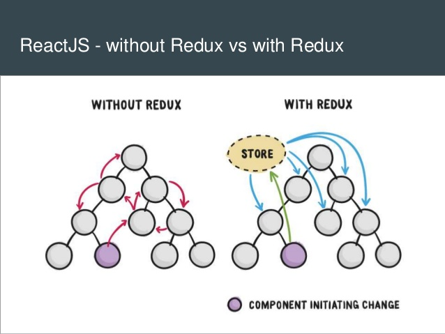
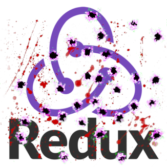

# The Mob X - Liquidation

Explicit

Too much boilerplate, especially for quick prototyping

All future code is unmaintainable but some take longer to reach that point.
Different team members, experiences, ignorance, status, ego, hippo's, everyone has different perspective
some just want to work, other want to express their passion, others wants appreciation and others wants 
a designer couch of 3999 euros. 

redux - mobx - hookstate

https://blog.logrocket.com/redux-vs-mobx/

https://praisethemoon.org/hookstate-how-one-small-react-library-saved-moonpiano/
https://github.com/avkonst/hookstate
