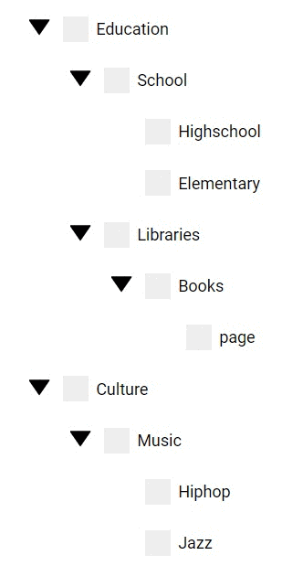

## Rescursive search tree



Simple tree


data prep

The data.json in the git repo contains the full data, but for the sake of clarity only 
a minimal sample has been displayed for demonstration purpose.

```
//data.json
//First level of branch to demonstrate the structure
{
  "name": "root",
  "children": [
    {
      "name": "Education",
      "children": [
        {
          "name":"School",
        }
      ]
    },
  ]
}
```

### Selection

States
```
const STATUS = {
    NONE: 1,
    CHECKED: 2,
    INDETERMINATE: 3,
};
```

| Case1  | Case2 | Case3 |
| ------------- | ------------- | ------------- | ------------- |
|   |  | 

### Search
 

Recursive search function
