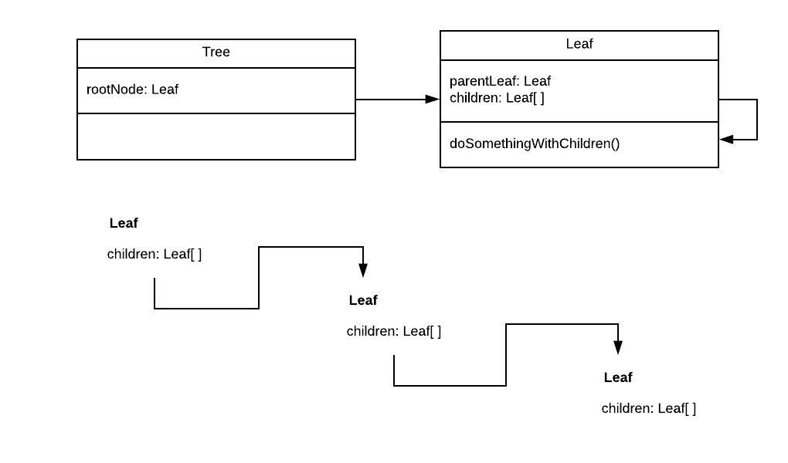

## Recursion tree has no incentive to leaf (Part1)

How to code a searchable code tree? After hours, maybe weeks, of meditation I came to the conclusion that my next goal has been 
in front of my very eyes... RECURSION. Recursion is the key 
for creating managable tree structures. 
For sure you could harcode every branch and leaf but that gets unmaintainable very quickly.
From my experience I believe that most developers evade the recursion topic, but it could
be a helpful tool for many cases not just for trees. 


Lets get started on building a simple and intuitive tree . I will use Lit Element but the concept is
applicable to infinity... and beyond. Lit is an light weight wrapper that relies heavily on web components and has
handy methods for data binding and property change callbacks. And the best part is that it does not get in the 
way of writing vanilla javascript with fancy framework stuff.

Here is the diagram that came to me on an adventurous bicycle ride at the mount everest without oxygen equipment
(they say that oxygen deprivation causes great inspirational sparks). So I stepped of my bike and got my laptop out to draw
it.



The leaf node is the important part where all the magic happens. Whereas the tree element is just a handy container for the root leaf
where it all begins. For example you could put methods in the tree element for manipulating the whole tree, this comes in handy later on
when doing the searching. So the tree element has one leaf (the root) that contains child leafs. The root leaf won't
be visible at all, has only children and is a virtual leaf as a mounting point for the first level of leafs. The root leaf will be still 
be visible at the end of part 1 next articles elaborate on that.

As you can observe from the above diagram it will be a play where recursion and composition will be in the spot light together.
The composition part comes to light where the leaf has a reference to its parent and children therefor a parent is able to do something 
with children. For the record this is not an advocation for pedopilia.  

These tree classes originated from shown diagram are the bare skeleton the data binding comes up next.
```
//app.js
// this is the main App class where the app starts from
class MyApp extends LitElement {
    render() {
        return html`
            <custom-tree></custom-tree>
        `;
    }
}

```
```
//tree.js
// this class gets registered to <custom-tree></custom-tree>
export class Tree extends LitElement{

    render() {
        return html`
            <custom-leaf></custom-leaf>
        `
    }
}
```
```
//leaf.js
// this class gets registered to <custom-leaf></custom-leaf>
export class Leaf extends LitElement{

    render() {
        return html`
            ${this ? html`
                ${
                    this.leaf.name ? html`
                        <div class="node">                            
                            <div class="item">
                                <p>${this.leaf.name}</p>
                            </div>
                        </div>
                    `: ''
                }
                <div>
                    ${this.hasChildren() ? this.renderChildren() : ''}
                </div>
            `: ''}
        `
    }

    // loops through child leaf references and outputs the html for each element
    // if it has no children no html will be produced
    renderChildren(){
        return html`
            <ul>
                ${this.childrenRef.map(leaf => html`
                    ${leaf}
                `)}
            </ul>
        `
    }

    hasChildren(){
        return !!this.childrenRef.length;
    }
}


```

### Lit & Data Binding
To go any further some explaining on the Lit and data binding front is essential to get the gist of my story. 

```
//within a Class that extends LitElement

// define the properties of this class which Lit Element has to monitor for changes
static get properties() {
    return {
        leaf: { type: Object },
    };
}

// The Render function renders the html with a Lit HTML helper.
// Everytime the this.leaf prop changes then the html of that part will be rerendered
// with the new values (the lit html helper takes care of all that stuff)
render() {
    return html`
         <div>
             ${this.leaf.name}
         </div>
    `
}

// this updated function is being called everytime 
// one of the props of the properties() function has changed
updated(_changedProperties) {
    if(_changedProperties.has('leaf')){
        //do something when the class' leaf property has changed 
    }
}
```

For example the MyApp needs a data property so we define a data property in the properties() function.
Everytime the this.data gets changed all the html element that are bound to this prop will get notified with
the new data. In our case the custom-tree element has the data prop of MyApp bound to its own data prop.

```
const apiData = require('../data.json');

class MyApp extends LitElement {

    static get properties() {
        return {
            data: { type: Object },
        };
    }

    constructor(){
        super();
        this.data = prepData(apiData);
    }
    render() {
        return html`
            <custom-tree .data="${this.data}"></custom-tree>
        `;
    }
}
```

**Recap**: MyApp changes this.data -> the &lt;custom-tree&gt; is bound to this.data and gets notified -> the updated() function of
&lt;custom-tree&gt; is being called -> you could react on this change

### Data Preparation

The data.json in the git repo contains the full data, but for the sake of clarity only 
a minimal sample has been displayed for demonstration purpose.

Each leaf represents a category ... yeah I know it's unoriginal and boring (probably the oxygen deprivation talking). But it is able to illustrate
my point very effictively so suck it up ;) Every category could have subcategories and it can never occur that a subcategory is not a 
subset of its parent.

```
//data.json 
// This data comes normally externally from an api or so
// First level of branch to demonstrate the structure
{
  "name": "root",
  "children": [
    {
      "name": "Education",
      "children": [
        {
          "name":"School",
        }
      ]
    },
  ]
}
```

In my opinion every data set needs some sort of preparation. So that every unit that consumes the data knows
what to expect. This decreases the changes of unexpected null pointers happening as well. Magical hype words are consistency and one source of truth. In vanilla javascript it could be a mess
in no time if the developer doesn't give a damn about code readability/maintainability at all. Just keep adding
random properties on the fly to passed on objects. 

```
// This will be the leaf object after prepping the raw data.json
// Type Leaf
{
  name: String                  // category name
  children: Leaf[],             // the child leaf of this leaf
  hide: Boolean,                // flag used for collapsing the branches visually (like the first simple tree gif shows)
  included: Boolean,            // flag used for showing only the branches that contain the searh term 
}
```

Below is the function that recursively prepares the data like above schema. The first item of the json data is the root 
leaf object that contains children. The error handling will secure that the data will be prepped as expected. I always like
to have factory functions like createNode() that returns on object from given params no matter how small the objects
are to be. The reason is that factory functions are easily expendable that means that you don't have to change raw js Object literals everywhere
they have been implemented.
```
{children: [Leaf1,Leaf2...]}
```

```
//utils.js
export const prepData = (data) => {
    if(!data) {
        console.warn('the input data is undefined so nothing to prep');
        return createNode(data,true,false);
    }

    if(Array.isArray(data)) throw Error('Could not prep, input must be object');
    if(data.children && !Array.isArray(data.children)) throw Error('if children prop exist it must be an array');

    let preppedData = createNode(data,false,true);

    if(data.children){
        let children = [];
        for(let child of data.children){
            children.push(prepData(child))
        }
        preppedData.children = children;
    }
    return preppedData;
};

const createNode = (data, hide, included) => ({
    ...data,
    children: data.children || [],
    hide: hide,
    included: included,
});

```

#### Step visualization ####
Although this kind of recursion is the most basic form, if one is not accustomed to the though process it could be 
a little bit daunting. The search function is more advanced in the sense of that it first feedbacks back to its children
and then compounds the results of that with its current state. But don't worry basics first :) I am not a seasoned teacher
so I hope that the step visualization makes somehow sense.
```
const Leaf3 = {};
const Leaf2 = {children: [Leaf3]};
const Leaf1 = {};
const preppedDate = {children: [Leaf1,Leaf2]};

prepData(preppedDate)
    // firstNode = createNode from preppedDate

    // loop through preppedDate.childeren
        //iteration with Leaf1

            //leaf1Node = prepData(Leaf1)
                        // newNode = createNode from Leaf1
                        // Leaf1 has no children in object so do nothing
                        // return newNode

            //firstNode.children array add Leaf1Node

        //iteration with Leaf2

            //leaf2Node = prepData(Leaf2)
                        // newNode = createNode from Leaf2

                        // loop through Leaf2.childeren
                                //iteration with Leaf3

                                    //leaf3Node = prepData(Leaf3)
                                                // newNode = createNode from Leaf3
                                                // Leaf3 has no children in object so do nothing
                                                // return newNode
                                    //leaf2Node.children array add Leaf3Node

                        // return newNode

            //firstNode.children array add Leaf2Node

    //return firstNode (firstNode has the children array now filled with its newly created children
```

### Now What? ###

So we have our skeleton code, know how to bind data and our data is prepped and eagerly waiting in the MyApp data prop.
Firstly lets rig our Leaf component class with the knowledge we have gained. 
- **ParentRef**: Every time we create a new Leaf we will pass in the reference of the Leaf whom created it.
- **ChildrenRef**: When the leaf property changes (and on creation) make for each child of the leaf data of new Leaf() component
and put it into this.childrenRef
- **Render** the childrenRef to its html through the binding with this.childrenRef. This is done by looping
through the childRefs everytime the childRefs have changed 

```
// Leaf.js -> Class Leaf

// parentRef is not listed here because it does not have to be monitored for changes.
// none of its html is bind with the parentRef
static get properties() {
    return {
        leaf: { type: Object },      

            //bound within html for rerendering the childRef each time it changes (point 3)           
        childrenRef: { type: Array },
    };
}

// Init parentRef and childref, the root node does not have a parent so it will be undefined
// This is handy for detecting the root node for some case with if(this.parentRef)
constructor(parentRef){
    super();
    this.parentRef = parentRef;
    this.childrenRef = [];
}

//is called on every creation
firstUpdated(_changedProperties) {
    this.leafChanged();
}

// is called whenever properties change of this component, listen for leaf change
updated(_changedProperties) {
    if(_changedProperties.has('leaf')){
        this.leafChanged();
    }
}

// Recreates the childrenRefs from the new set leaf data
// When the this.childrenRef is being set lit element detects a change and the html
// will be rerendered with these new ChildRefs.
leafChanged(){
    if(this.leaf.children)
        this.childrenRef = this.leaf.children.map(leafData => {
            const leaf = new Leaf(this);
            leaf.leaf = leafData;
            return leaf;
        });
}
```

Then check if the leaf has children if so render those. Because of the binding of this.childrenRef it will
be redrawn by a change ... yeah I have said it too many times that it gets annoying. The recursion happens
when the childRef leaf is being put into the dom it will then trigger itself again with the same logic. The base
case of the recursion will be triggered when the leaf does not have any children. No children means that it outputs no <custom-leafs> 
any more and the feedback loop stops.

```

render(){
    return html`
        <p>${this.leaf.name}</p>
        <div>
            ${this.hasChildren() ? this.renderChildren() : ''}
        </div>
    `
}

renderChildren(){
    return html`
        <ul>

            // Everytime the this.childrenRef changes this map function is being called
            // and therefor rerender with the new childRef
            ${this.childrenRef.map(leaf => html`
                ${leaf}
            `)}
        </ul>
    `
}

hasChildren(){
    return !!this.childrenRef.length;
}

```


### Fitting the pieces
To summarize if you want to implement recursion just step on your bike and any 
form of oxygen deprivation causes you to make great recursive solutions. What I have discussed
is a simple tree structure, the tip of the ice berg ...uh I mean mount everest. It does not yet
look similar to the intro image of the tree. In the sections coming up I will do some more interesting things
with the tree such as hiding branches, selecting leafs, selection propagation and searching branches.

So for now you have to do it with a recursion tree in discount from the Blokker. But it will soon grow to 
a full grown tree.

