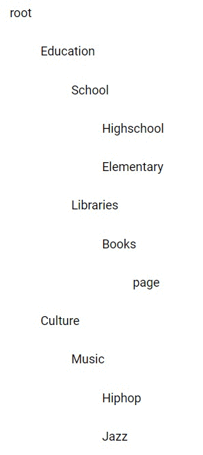
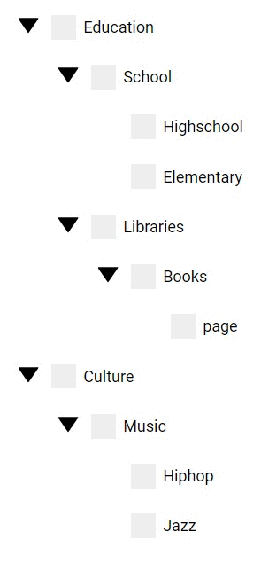

## Recursion Tree Hide and Seek (Part2)

| Before  | After |
| ------------- | ------------- | ------------- | ------------- |
|  | |

This post makes only sense after reading the first part  
[Recursion Tree Has No Incentive to Leaf (Part1)](http://leonstel.github.io/recursive_tree_part1)

To recall, our data has been prepped so that every leaf has got some extra flags. Every leaf 
can be sure to receive those flags with its detaults on start up because of the prepping. Yeah it would be possible to leaf the hide
prop null without prepping that part, but that does not line up with my data consistency rule.

Hiding a branch means collapsing its child leafs when clicking on the arrow like shown in the intro image.

```
// This will be the leaf objects within the data tree after prepping the raw data.json
// Type Leaf
{
  name: String                  // category name
  children: Leaf[],             // the child leaf of this leaf
  hide: Boolean,                // flag used for collapsing the branches visually (like the first simple tree gif shows)
  included: Boolean,            // flag used for showing only the branches that contain the searh term 
}


//leaf.js
// add hide prop to prop array because we want to bind it with html element
static get properties() {
    return {
        ....
        hide: {type:Boolean}
    };
}
```

##### Arrows
The arrows are only allowed to be displayed when the leaf has children. They are mostly done with css that uses 
different classes to manipulate the direction which it is pointing at. You can check those out in the css of the leaf.js 
file. 

A fold handler which will be called every time you have clicked an arrow and switches the hide prop to its opposite.
Remember that the hide props has been bound in the html so that everything involving this prop rechecks the condition
which result in a rerender of that part in the DOM.

```
//leaf.js
${  

    // Only show arrow when it has children
    this.hasChildren() ? html`
        <div class="arrow">

            //Switch the direction of the arrow depending of its in hinding or not
            
        </div>       
    ` : html``
}

// click handler of the arrow to switch the hide flag to its counterpart
fold(){
    this.hide = !this.hide;
}
```

##### Root Node Case
The icing on the cake, the root node must be invisible at all times. But it still has to render its children leafs, otherwise the whole tree won't be rendered at all.

```
render() {
    return html`
        ${
        // When the leaf is the root node don't render anything
        this.parentRef  ? html`
            //leaf render here
        ` : '';

        // The rendering of the children will be outside of the above check
        // So that the children will still be rendered it if it the root node
        <div class="${this.hide ? 'hide': ''}">
            ${this.hasChildren() ? this.renderChildren() : ''}
        </div>
}
```

##### Bonus Jackpot
An extra advantage of the hide flag being prepped to the input data is that it could be manipulated
from external code. If the hiding logic only resided in the leaf object itself no external code could easily change its
 hide state. For example you could give the tree  a blueprint of the leafs which you want to hide/select. 
 A conversation between those two would be like: 

<sub>Code: "HEEE.. PSST.. ARE YOU UP?"</sub>  
<sub>Tree: "NOW I DO.., WHAT DO YOU WANT IT MUST BE OF REAL IMPORTANCE AT THIS TIME OT THE NIGHT"</sub>  
<sub>Code: "HEEE... HEEEEEE... HIDE THE NTH LEAF FROM BRANCH TWO!"</sub>  
<sub>Tree: "F*K OFF"</sub>        


### Selection

So now we have the hiding part in place it's time for some simple selection without complicated cases.


### Status
It all begins by defining a way to tell the leaf what selection types are possible. I am a big fan of enum like objects 
wherever possible this gives create flexibility comparing to hardcoded strings or integers. When using
Typescript I encourage you to heavily use [enums](https://www.typescriptlang.org/docs/handbook/enums.html) or 
[interfaces](https://www.typescriptlang.org/docs/handbook/interfaces.html) for this.
```
//leaf.js
const STATUS = {
    NONE: 1,
    CHECKED: 2,
    INDETERMINATE: 3,       
};
```
[The indeterminate section on mozilla on the checkbox](https://developer.mozilla.org/en-US/docs/Web/HTML/Element/input/checkbox) 
gives some clarification about what indeterminate means.

Define the status property and initialize it with the non selected status.

```
//leaf.js
static get properties() {
    return {
        status: {type: Number},
    };
}

constructor(){
    this.status = STATUS.NONE;
}
```

Define the checkbox which will be the new html part of the leaf's DOM. The checkbox has been bound on the status 
property. Each time the status prop changes the checkbox will set its state accordingly by settings some classes and 
the checked and indeterminate props of the input element. Subsequently a click handler will set the appropriate state
when the leaf has been clicked.

```
//leaf.js
render()
    <div class="item" @click="${this.clicked}">
        <div class="checkbox">
            <input type="checkbox" 
                class="${this.status === STATUS.INDETERMINATE ? 'indeterminate':''}" 
                .checked=${this.status === STATUS.CHECKED} 
                .indeterminate=${this.status === STATUS.INDETERMINATE}>
            <span class="custom-checkbox"></span>
            <span class="mark checkmark"></span>
            <span class="mark indeterminate-mark"></span>
        </div>
        <p>${this.node.name}</p>
    </div>

//

// When clicked
// If the checkbox is checked uncheck it
// If the checkbox is unchecked or indeterminate check it
clicked(){
    if(this.status === STATUS.CHECKED){
        this.status = STATUS.NONE;
    }else if(this.status === STATUS.NONE || STATUS.INDETERMINATE){
        this.status = STATUS.CHECKED;
    }
}
```

### Implementing the Tricky Parts

We will now elaborate on more fun selection cases. Remember that every subcategory must be a subset of its parent, with 
that in mind I have come up with three cases I am going to implement. 

| Case1  | Case2 | Case3 |
| ------------- | ------------- | ------------- | ------------- |
|   |  | 

##### Case1  
If a category has been selected that means that every child of that category must be selected too.
For example if something belongs to education it belongs to all educational matters as well.

##### Case2
If a category has been deselected that means that it is no longer a fully matched subset to its parent, all its
parents in the leaf's branch must be deselected as well.

##### Case3
When a leaf hides its children but its children do have some but not all leafs selected notify the user with an indeterminate 
checkbox. If a leaf is being hide and all its children has been selected then this leaf will still be selected (this 
last one is not displayed in the case table).

### Into Practice

After wearily long talk about the leaf's parentRef and childrenRefs in previous article they can finally be utilized.


In theory you could get 3 deep from the current leaf by
on every 
``` 
// hardcoded example for illustrating the principle
currentLeaf.parentRef.parentRef
currentLeaf.childrenRefs[0].childrenRefs[0].childrenRefs[0]
```

```
//leaf.js
callChildren(method){
    for (let childRef of this.childrenRef){
        childRef[method.name]();
    }
}
```

```
determineStateDown(){
    switch (this.status) {
        case STATUS.NONE:
            this.callChildren(this.setNone);
            break;
        case STATUS.CHECKED:
            this.callChildren(this.setChecked);
            break;
    }
}

determineStateUp(newState){
    if(this.parentRef) {
        if(newState === STATUS.NONE)
            this.parentRef.status = STATUS.NONE;

        // this.parentRef.touch();
        this.parentRef.determineStateUp(newState)
    }
}
```

```
clicked(){
    //... current leaf state code

    this.determineStateDown();
    this.determineStateUp(this.status);
}
```


Begin to see daylight

When the band begins to play
