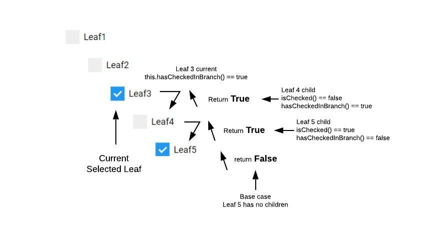

## Recursion Tree Fairy Tail (Part3)


### Once Upon a Time
... a boy was born within a lovely family. Within the boy an evil entity began to grow slowly but steadily.
Not very much later this evil entity overpowered him and his craving for more got out of control. Without any wealth, his 
greed told him to make cheap ass paid courses about getting rich quick. The boy couldn't be happier, it worked and students were
buying his courses like ice scream. Every student whom followed the boys' courses had been contaminated with the ever growing evil
and were already planning to make a course about getting rich quick to satisfy their hunger. They won't live happily ever after.

Although this fairy tail isn't officially a [greedy algorithm](https://en.wikipedia.org/wiki/Greedy_algorithm) it sure sounds like one. 

### Base Case
As above tail makes clear, having no base case within a recursion loop will result in an infinity amount of callbacks 
because it keeps going forever. Eventually it will throw a maximum call stack exceeded error. A base case is a condition
within the recursive function that returns some kind of value (could be an empty return as well) to stop the feedback loop. 
Although morbidly, the universe has no built-in base case so the fairy tail goes on and on till the human race goes 
extinct ...happy hollidays!


### Do I Have Children?

This question mostly asked to yourself when the doorbell rings and a vaguely familiar woman stands in front of your 
door. It then kicks in... that night from years ago that has some memory gaps. 

Spoiler, no it's not like that just talking about the children of the recursive tree.

In previous article (part 2) we have covered some selection cases. The only one left involves the indeterminate state
of the leaf if it is in hiding and some of its children are selected. How does the leaf know if any childs are checked?


For that I've come up with the recursive ```hasCHeckedInBranch()``` that returns ```true``` if it has any checked childs 
and ```false``` if none of them are selected. Although it seems like a simple and brief function getting it right was
driving me up the wall at some moments.

```
//leaf.js
hasCheckedInBranch() {
    for (let childRef of this.childrenRef){
        const flag = childRef.isChecked() || childRef.hasCheckedInBranch();
        if(flag) return true;
    }
    return false;
}
```



### Searching


Same principle as hasCheckedInBranch(), but there is a big difference on the data which is is done.
This is done at the tree level. (tree has leafs)  and the hasChcked is a function within the Leafs
This edits the input data -> tree renders itself because of binding -> childs include themself with the included flag
```
//tree.js
searchRecursive(children, s) {
    let found = false;
    if (children) {
        for (let child of children) {
            const searchFound = this.searchRecursive(child.children, s) || child.name.toLowerCase().includes(s.toLowerCase());
            child.included = searchFound;
            if (searchFound) {
                found = true;
            }
        }
    }
    return found;
}
```


